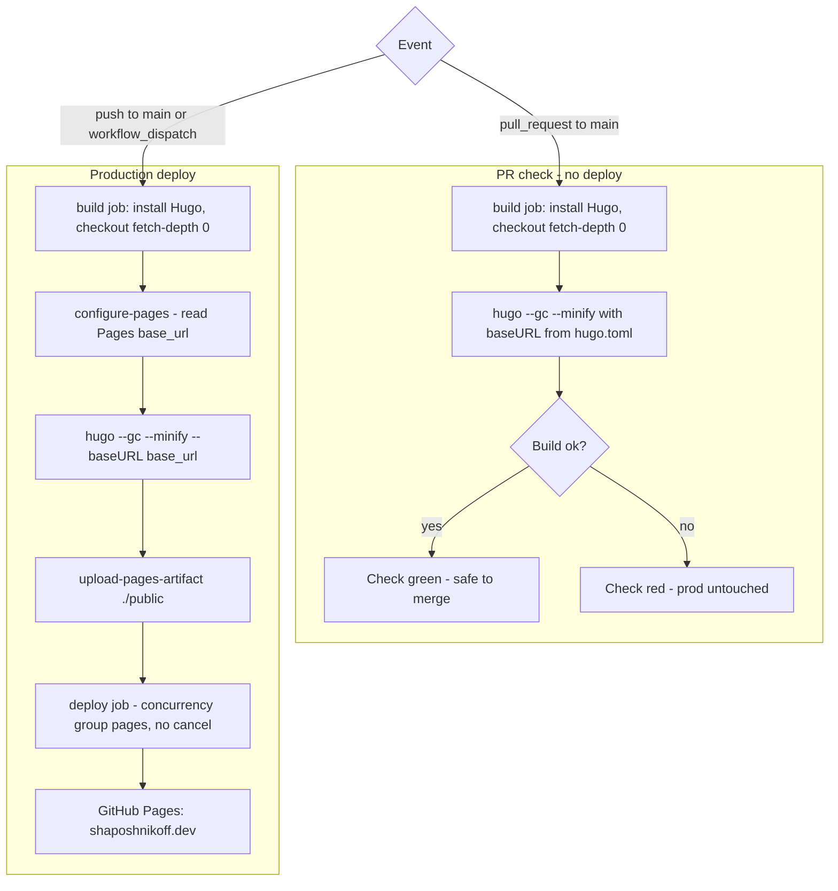

# Deploy pipeline

Source: `.github/workflows/deploy.yml`.

```mermaid
flowchart TD
    trigger{"Event"}
    trigger -->|"pull_request to main"| pr_build
    trigger -->|"push to main or workflow_dispatch"| main_build

    subgraph pr_check["PR check - no deploy"]
        pr_build["build job: install Hugo, checkout fetch-depth 0"]
        pr_hugo["hugo --gc --minify with baseURL from hugo.toml"]
        pr_result{"Build ok?"}
        pr_build --> pr_hugo --> pr_result
        pr_result -->|"yes"| pr_pass["Check green - safe to merge"]
        pr_result -->|"no"| pr_fail["Check red - prod untouched"]
    end

    subgraph prod["Production deploy"]
        main_build["build job: install Hugo, checkout fetch-depth 0"]
        pages_cfg["configure-pages - read Pages base_url"]
        main_hugo["hugo --gc --minify --baseURL base_url"]
        upload["upload-pages-artifact ./public"]
        deploy["deploy job - concurrency group pages, no cancel"]
        live["GitHub Pages: shaposhnikoff.dev"]
        main_build --> pages_cfg --> main_hugo --> upload --> deploy --> live
    end
```
